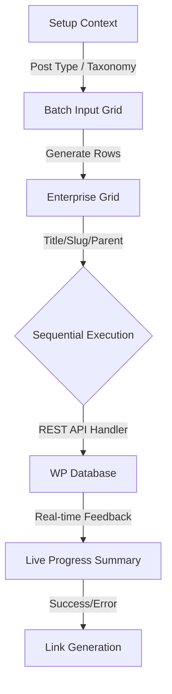

  
  
  # WP Bulk Pages Generator 🚀
  ### *The Future-Proof Enterprise Engine for WordPress 2026*
  
  
  
  
  
  [Overview](#-overview) • [Bento Features](#-the-bento-experience) • [How it Works](#-the-engine) • [Installation](#-deployment)

---

## ⚡ Overview

Stop wasting hours on manual page creation. **WP Bulk Pages Generator** is a high-performance, enterprise-grade deployment engine designed to help developers and agency owners build large-scale WordPress sites in seconds. Engineered for **Zero Friction**, **Zero Bloat**, and **Maximum Accessibility**.

---

## 🍱 The Bento Experience

<table width="100%">
  <tr>
    <td width="50%" valign="top">
      <h3>💎 Modern Architecture</h3>
      Built on the <b>Geist Design System</b>. A high-density interface with 40px touch-targets and micro-animations for a fluid, premium experience.
    </td>
    <td width="50%" valign="top">
      <h3>📱 Mobile-First Native</h3>
      Our <b>Card-View Transformation Engine</b> turns complex data tables into breathable, touch-ready cards on mobile devices automatically.
    </td>
  </tr>
  <tr>
    <td width="50%" valign="top">
      <h3>♿ Ethical A11y</h3>
      Native support for <b>WCAG 2.2 Level AA</b>. Features focus management, ARIA-live progress regions, and keyboard-first navigation.
    </td>
    <td width="50%" valign="top">
      <h3>🧱 Block-Powered</h3>
      Native validation for <b>Gutenberg Block Markup</b>. Deploy complex FAQ patterns, CTAs, and layout sections via raw list injection.
    </td>
  </tr>
</table>

---

## ⚙️ The Engine

How our **Zero-Timeout Deployment Logic** handles your content batches:

---

## 🏗️ Deployment Lifecycle

### 1️⃣ Contextual Discovery
The plugin identifies hierarchical relationships and available taxonomies for any **Public Post Type**. Select "Page" and see parent-child dropdowns; select "Post" and see Categories/Tags.

### 2️⃣ Rapid In-Grid Entry
Utilize the **Geist-inspired Table** to input titles and slugs. Leave slugs blank? The engine auto-generates SEO-optimized URLs. Need nesting? The parent selector updates in real-time.

### 3️⃣ Sequential Creation
When you hit **Create All**, we don't just dump data. Our `async/await` loop processes rows one by one, ensuring your server remains responsive and avoiding the dreaded PHP execution timeouts.

### 4️⃣ Live Status Armor
Integrated **State Armor** prevents you from accidentally leaving the page during creation. Real-time status icons and `aria-live` announcements keep you informed of every step.

---

## 🛠️ Technical Stack

- **Backend**: Hardened PHP REST API (7.4 - 8.2+) with strict Nonce validation.
- **Frontend**: Optimized jQuery + Tippy.js with Zero Layout Thrash logic.
- **UI**: Vanilla CSS Variables, CSS Containment for performance, and SVG-Icons.
- **A11y**: Managed Tab-order, high-visibility focus rings, and automated accessibility tips.

---

## 📥 Deployment

1.  Clone this repository into your `/wp-content/plugins/` directory.
2.  Activate via **WP Admin**.
3.  Launch the engine from the **"Bulk Pages"** menu item.

---

   
  
  
   
  © 2026 WP Bulk Pages Generator. Engineered for the Future.

