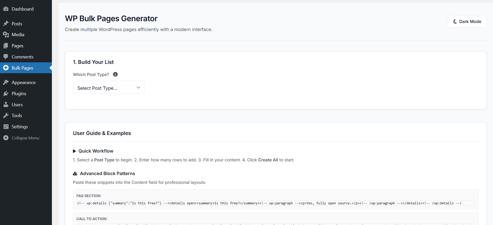
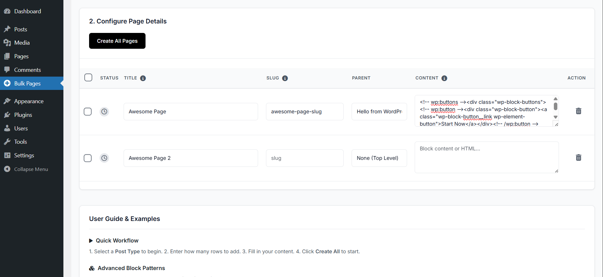
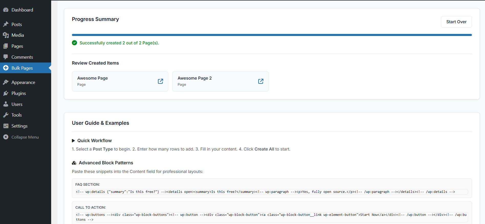
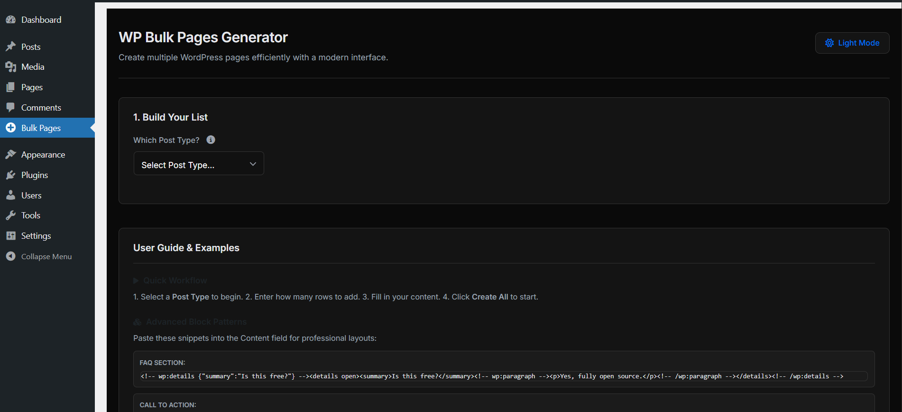
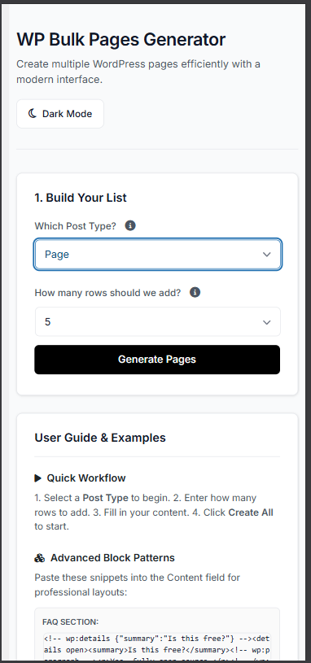
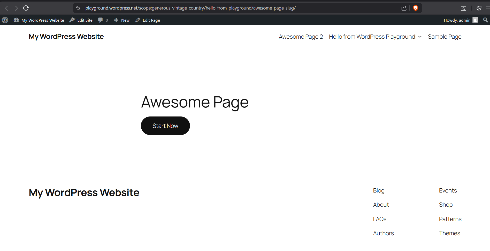
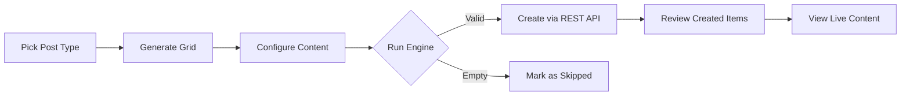

  
  
  # WP Bulk Pages Generator 🚀
  ### *The Ultimate Enterprise-Grade Bulk Content Engine for WordPress 2026*
  
  **Deploy Landing Pages, SEO Silos, and Content Batches in Seconds with the Speed of Geist.**
  
  
  
  
  

  [Overview](#-overview) • [Full Feature List](#-unrivaled-feature-set) • [The Admin Experience](#-inside-the-command-center) • [Use Cases](#-content-strategies--use-cases) • [Installation](#-deployment-guide) • [GitHub](https://github.com/boopathirbk/wp-bulk-pages-generator)

---

## ⚡ Overview

Manual page creation is a bottleneck for agencies and SEO pros. **WP Bulk Pages Generator** is engineered to eliminate that friction. Built on the **Geist Design System**, it provides a high-performance, single-page interface to bulk-generate hundreds of Pages, Posts, or Custom Post Types (CPT) with precision taxonomy and parent-page nesting.

---

## 📸 Visual Gallery

<table width="100%">
  <tr>
    <td width="33.3%" align="center">
      
       <b>1. Build Your List</b>
    </td>
    <td width="33.3%" align="center">
      
       <b>2. Configure Details</b>
    </td>
    <td width="33.3%" align="center">
      
       <b>Progress Summary</b>
    </td>
  </tr>
  <tr>
    <td width="33.3%" align="center">
      
       <b>Premium Dark Mode</b>
    </td>
    <td width="33.3%" align="center">
      
       <b>Mobile Responsive View</b>
    </td>
    <td width="33.3%" align="center">
      
       <b>Review Created Items</b>
    </td>
  </tr>
</table>

---

## 🍱 The Bento Experience

<table width="100%">
  <tr>
    <td width="50%" valign="top">
      <h3>💎 Geist Architecture</h3>
      A minimalist, high-density interface focused on <b>zero cognitive load</b>. Features 40px touch-targets and buttery-smooth micro-animations.
    </td>
    <td width="50%" valign="top">
      <h3>📱 Mobile-First Cards</h3>
      Automatic <b>Table-to-Card transformation</b>. Manage your content grid from a phone with the same precision as a desktop.
    </td>
  </tr>
  <tr>
    <td width="50%" valign="top">
      <h3>♿ WCAG 2.2 Level AA</h3>
      Native support for accessibility standards. High-visibility focus rings, ARIA landmarks, and <b>Live Progress Announcements</b>.
    </td>
    <td width="50%" valign="top">
      <h3>🧱 Gutenberg-Ready</h3>
      Full support for <b>Block Markup</b>. Paste complex FAQ patterns or CTA sections directly into the content grid.
    </td>
  </tr>
</table>

---

## 🛡️ Unrivaled Feature Set

- **💎 Geist Architecture**: A minimalist, high-density interface focused on **zero cognitive load**. Features 40px touch-targets and buttery-smooth micro-animations.
- **🛡️ State Armor (Operation Lock)**: Prevents accidental navigation or page refresh while your batch is processing.
- **🔄 Zero-Reload Reset**: Reset your entire workspace instantly with the "Start Over" logic—no page reload required.
- **🍱 Advanced Taxonomy Layer**: Deep hierarchical support for Parent Pages, Categories, and Custom Taxonomies.
- **⚡ Async Sequential Engine**: Processes rows one by one via REST API to avoid server timeouts and database lockouts.
- **🌗 Intelligent Dark Mode**: Respects system preferences and includes an immediate manual toggle for low-light work.
- **📢 Real-Time A11y Regions**: progressive `aria-live` updates keep screen readers informed of success/error counts.
- **📐 WCAG 2.2 Level AA**: Fully compliant with the latest 2026 accessibility standards, including "Focus Not Obscured" and 24px+ hit targets.
- **📏 WIG Compliant**: Adheres to Vercel's Web Interface Guidelines for stable skeletons, no dead ends, and typographic excellence.

---

## 🏗️ Inside the Command Center

### 1️⃣ Build Your List (Setup)
Select your target **Post Type**. Enter your desired row count (supports **1 to 100 rows** per batch). The system instantly caches parent-page and category data to fill the grid.

### 2️⃣ Configure Details (Dynamic Grid)
An enterprise-grade interactive table featuring:
- **Dynamic Headings**: Automatically updates to "Configure Page Details" or "Configure Post Details" based on selection.
- **Status Icons**: Real-time visual feedback (Pending, Loading, Success, Error, Skipped).
- **Intelligent Slugs**: Auto-generates SEO-friendly URLs if left blank.
- **Bulk Selection**: Select all or specific rows to batch-delete before processing.
- **Live Tooltips**: Comprehensive Tippy.js powered hints for every column.

### 3️⃣ Creation & Results (Summary)
Hit **Create All Pages** (the button dynamically reflects your Post Type). The system validates titles, skips empty rows, and runs an `async` loop. Once finished, a **Review Created Items** gallery appears with direct "View" links to your new content.

---

## 📝 Content Strategies & Use Cases

| Use Case | How to Use It |
| :--- | :--- |
| **SEO Silo Building** | Bulk-create regional landing pages (e.g., "Plumber in New York", "Plumber in Austin") with correct Parent/Child nesting. |
| **Product Catalogs** | Deploy basic WooCommerce Product skeletons or Portfolio CPT entries with Category assignment. |
| **FAQ & Knowledge Bases** | Use our **FAQ Block Pattern** examples to deploy 50+ Help Articles in one batch. |
| **Corporate Structures** | Quickly build complex site maps (About, Mission, Team, Careers) during initial staging. |

---

## ⚙️ The Engine Flow

---

## 🚀 Deployment Guide

### Prerequisites
- **WordPress**: 6.0+ (Fully optimized for **6.9.1**)
- **PHP**: 7.4 through 8.2+
- **Privileges**: Administrator or user with `manage_options`.

### Installation Steps
1. **Download**: Clone or Download this repository as a ZIP.
2. **Upload**: Go to `Plugins > Add New > Upload Plugin`.
3. **Activate**: Click "Activate" and look for **Bulk Pages** in your sidebar.

---

---

## ❓ Frequently Asked Questions (FAQ)

### 📈 Can I use this for SEO Silo building?
Absolutely. The hierarchical parent-selection logic is specifically engineered for building deep silo structures and regional landing page hierarchies with precision.

### 🍱 Does it support Custom Post Types (CPT)?
Yes. The plugin auto-detects all public post types—including WooCommerce Products, Portfolio items, and custom types—and adapts its UI placeholders and taxonomy logic to match.

### ⚡ Is there a limit to the number of pages I can create?
The interface is optimized for batches of 1 to 100 rows. This ensures that the sequential `async` engine can process your content without triggering PHP server timeouts.

### 🛡️ How secure is the creation process?
Your site's security is our priority. Every creation request is Nonce-locked and processed through validated REST API endpoints with strict `manage_options` capability checks.

### 🧱 Can I use Gutenberg Block patterns?
Yes. You can paste raw Gutenberg block markup (including complex FAQ, CTA, or Grid blocks) directly into the "Content" field, and the engine will preserve the formatting perfectly.

### 🌓 Does it support Dark Mode?
Yes. We've implemented a **Geist-inspired Dark Theme** that respects your OS/WordPress preferences or can be toggled manually via the admin header.

---

## 📖 Step-by-Step Tutorial

### Part A: Preparing the Grid
1. Select **"Page"** or **"Post"** from the dropdown. 
2. Enter **"10"** in the counter.
3. Click **"Generate Pages"** (label updates to your choice).

### Part B: Batch Entry
1. Type your **Titles** in the Title column.
2. (*Optional*) Assign a **Parent** or **Category**.
3. (*Pro Tip*) Paste a **Block Pattern** in the Content column (find examples in the **User Guide** page!).

### Part C: The Big Red Button
1. Review your data.
2. Click **"Create All Pages"** (or your selected type).
3. Monitor the **Progress Bar**. Once complete, either click "Start Over" for a new batch or browse your new pages via the links.

---

## 🛠️ Technical Stack & Quality
- **Design System**: [Geist](https://vercel.com/design) (Minimalist, Enterprise-Grade).
- **Compliance**: **WCAG 2.2 Level AA** (Touch targets, Focus visibility) & **WIG** (Typographic excellence).
- **Core Engine**: WordPress REST API with Sequential `async` processing.
- **Security**: Strict Nonce-validation, `sanitize_text_field`, and `wp_kses_post` protection.
- **Performance**: Use of `DocumentFragment` for 0ms UI lag on 100-row injections.

---

## 🔍 SEO Strategy Tags
`WordPress Bulk Page Generator` `Batch Content Creator` `SEO Silo Builder` `Gutenberg Bulk Deployment` `Fast WordPress Setup` `WP REST API Plugin` `Geist UI WordPress` `WCAG 2.2 WordPress Plugin`.

---

   
  
  
   
  Built with ❤️ for the WordPress Community. © 2026.

